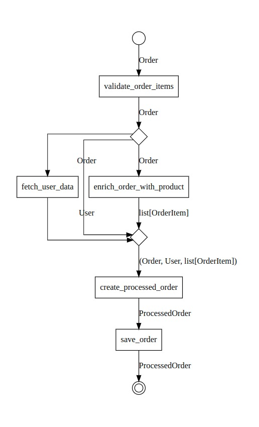

# Gloe & FastAPI

Let's create an example that demonstrates how to use Gloe with [FastAPI](https://fastapi.tiangolo.com/) to build a pipeline for process and store an e-commerce order in a HTTP server. 

## Setup

Ensure you have the necessary packages installed:

```shell
pip install gloe fastapi
```

The below imports are necessary for the rest of the code:

```python
from fastapi import FastAPI, HTTPException
from pydantic import BaseModel
from gloe import transformer, async_transformer
```

## Define the Models

We will define the Pydantic models for the order, user, and processed order:

```python
class Product(BaseModel):
    product_id: int
    quantity: int

class Order(BaseModel):
    id: int
    user_id: int
    items: list[Product]

class User(BaseModel):
    id: int
    name: str
    email: str
    shipping_address: str

class OrderItem(BaseModel):
    product_id: int
    name: str
    quantity: int
    price: float

class ProcessedOrder(BaseModel):
    order_id: int
    user: User
    items: list[OrderItem]
    total_amount: float
```


## Define the Transformers

The bellow transformers will be used to process the order data.

The first transformer validates the order items, ensuring that the products exist:

```python
@async_transformer
async def validate_order_items(order: Order) -> Order:
    """Validates order data, ensuring items exist."""
    item_ids = [item.product_id for item in order.items]
    try:
        _ = await ProductService.get_by_ids(item_ids)
    except ProductNotFoundError as e:
        raise HTTPException(status_code=404, detail=str(e))
    return order
```

```{important}
All the services (`ProductService`, `UserService`, and `OrderService`) are assumed to be available and implemented elsewhere.
```

```{note}
```

The second one fetches user data based on the user ID from the order:

```python
@async_transformer
async def fetch_user_data(order: Order) -> User:
    """Fetches user data based on user ID."""
    user_data = UserService.get(order.user_id)
    if not user_data:
        raise HTTPException(
            status_code=404,
            detail=f"User with ID {order.user_id} not found.",
        )
    return user_data

```

The third transformer enriches the order with product details:

```python
@async_transformer
async def enrich_order_with_product(order: Order) -> list[OrderItem]:
    """Adds product details to the order."""
    enriched_items = []
    for item in order.items:
        product = await ProductService.get(item.product_id)
        enriched_item = OrderItem(
            product_id=item.product_id,
            name=product.name,
            quantity=item.quantity,
            price=product.price,
        )
        enriched_items.append(enriched_item)
    return enriched_items
```

The fourth transformer creates the final processed order object:

```python

@transformer
def create_processed_order(
    data: tuple[Order, User, list[OrderItem]]
) -> ProcessedOrder:
    """Creates the final processed order object."""
    order, user, items = data
    total_amount = sum(item.price * item.quantity for item in items)
    processed_order = ProcessedOrder(
        order_id=order.id, user=user, items=items, total_amount=total_amount
    )
    return processed_order
```

The final transformer saves the order to the database:

```python
@async_transformer
async def save_order(order: ProcessedOrder) -> ProcessedOrder:
    """Saves the order to the database"""
    return await OrderService.store(order)
```

## Create the Pipeline

Finally, you our FastAPI app, we can call the process order flow with the order data:

```python

process_order = (
    validate_order_items
    >> (
        forward(),
        fetch_user_data,
        enrich_order_with_product,
    )
    >> create_processed_order
    >> save_order
)
```

Let's break down the pipeline:

1. The `validate_order_items` transformer is used first to validate the order items.
2. Then, a {ref}`parallel gateway <gateways>` is called with tree branches:
   1. The first branch is only a {class}`forward <gloe.utils.forward>` that only pass the order from the previous transformer to the next.
   2. The `fetch_user_data` transformer is placed on the second branch to fetch the user data based on the user ID from the order.
   3. In the last branch, `enrich_order_with_product` transformer is used to enrich the order with product details.
3. The next `create_processed_order` transformer receives the order, user, and items data from the branches to create the final processed order object.
4. Finally, the `save_order` transformer is appended to save the order to the database.

### Call the Pipeline

```python
app = FastAPI()

@app.post("/orders", response_model=ProcessedOrder)
async def create_order(order: Order):
    return process_order(order)
```


### Plot the Pipeline

Finally, we can visualize the pipeline using the {meth}`.to_image() <gloe.BaseTransformer.to_image>` method:

```python
process_order.to_image('process-order-pipeline.png')
```



