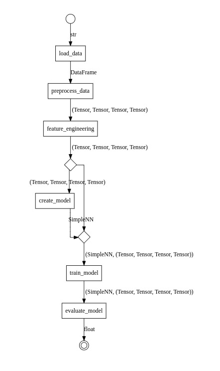

# Gloe & PyTorch


Let us create an enhanced data pipeline with Gloe and PyTorch.

## Introduction

In this example, we demonstrate how to use the Gloe library in combination with PyTorch to build a machine learning pipeline. Gloe simplifies the process of structuring and managing machine learning workflows by organizing them into a series of interconnected steps, known as transformers. Each transformer performs a specific task, such as data loading, preprocessing, feature engineering, model creation, training, and evaluation.

The objective of this example is to create a machine learning pipeline that:

1. Loads data from a CSV file.
2. Preprocesses the data by splitting it into training and testing sets and standardizing the features.
3. Applies feature engineering (though simplified in this example).
4. Defines a simple neural network model using PyTorch.
5. Trains the neural network model.
6. Evaluates the model's performance.

## Setup

Ensure you have the necessary packages installed:

```sh
pip install gloe torch pandas scikit-learn
```

The below imports are necessary for the rest of the code:

```python
import pandas as pd
import torch
import torch.nn as nn
from torch import Tensor
from sklearn.model_selection import train_test_split
from sklearn.preprocessing import StandardScaler
from gloe import transformer, partial_transformer
from gloe.utils import attach
```

## Define the Transformers

We will create transformers for loading data, preprocessing, feature engineering, model creation, training, and evaluation.

### Data Preprocessing Transformers

First, we define a transformer for loading the data from a CSV file using Pandas:

```python
@transformer
def load_data(file_path: str) -> pd.DataFrame:
    return pd.read_csv(file_path)
```

First, we define another transformer for preprocess the Pandas DataFrame, splitting it into training and testing sets, standardizing the features, and converting the data to PyTorch tensors:


```python
@transformer
def preprocess_data(df: pd.DataFrame) -> tuple[Tensor, Tensor, Tensor, Tensor]:
    X = df.iloc[:, :-1].values
    y = df.iloc[:, -1].values
    
    X_train, X_test, y_train, y_test = train_test_split(X, y, test_size=0.2, random_state=42)
    
    scaler = StandardScaler()
    X_train = scaler.fit_transform(X_train)
    X_test = scaler.transform(X_test)
    
    return (
        torch.tensor(X_train, dtype=torch.float32), 
        torch.tensor(X_test, dtype=torch.float32),
        torch.tensor(y_train, dtype=torch.float32), 
        torch.tensor(y_test, dtype=torch.float32)
    )
```

Once the type `tuple[Tensor, Tensor, Tensor, Tensor]` is used in many places, we can create a type alias for it:

```python
from typing import TypeAlias

Data: TypeAlias = tuple[Tensor, Tensor, Tensor, Tensor]
```

Thus, the definition of the `preprocess_data` transformer can be simplified:

```python
@transformer
def preprocess_data(df: pd.DataFrame) -> Data:
    ...
```

### Feature Engineering Transformers

The feature engineering transformer is responsible for adding new features or transformations to the data. In this example, we will keep it simple and not add any extra features:

```python
@transformer
def feature_engineering(data: Data) -> Data:
    X_train, X_test, y_train, y_test = data
    # Here you can add more features or transformations
    # Example: Add polynomial features, interactions, etc.
    # For simplicity, we will not add extra features in this example.
    return X_train, X_test, y_train, y_test
```

### Define the PyTorch Model and Training

The model implementation is a simple neural network with one hidden layer:

```python
class SimpleNN(nn.Module):
    def __init__(self, input_size, output_size):
        super(SimpleNN, self).__init__()
        self.fc1 = nn.Linear(input_size, 128)
        self.fc2 = nn.Linear(128, output_size)
    
    def forward(self, x):
        x = torch.relu(self.fc1(x))
        x = self.fc2(x)
        return x
```

The `create_model` transformer use the `X_train` shape to define the input size of the neural network. The return of this transformer is the model itself:

```python
@transformer
def create_model(data: Data) -> SimpleNN:
    X_train = data[0]
    model = SimpleNN(X_train.shape[1], 1)
    return model
```

The training transformer trains the model using the Adam optimizer and Mean Squared Error (MSE) loss function:

```python
import torch.optim as optim

@partial_transformer
def train_model(entry: tuple[SimpleNN, Data], epochs: int = 100) -> tuple[SimpleNN, Data]:
    model, data = entry
    X_train, X_test, y_train, y_test = data
    criterion = nn.MSELoss()
    optimizer = optim.Adam(model.parameters(), lr=0.001)
    
    for epoch in range(epochs):
        optimizer.zero_grad()
        outputs = model(X_train)
        loss = criterion(outputs, y_train.view(-1, 1))
        loss.backward()
        optimizer.step()
    
    return model, data
```

### Model Evaluation Transformer

The evaluation transformer evaluates the model's performance using same MSE loss:

```python
@transformer
def evaluate_model(entry: tuple[SimpleNN, Data]) -> float:
    model, data = entry
    X_train, X_test, y_train, y_test = data
    model.eval()
    with torch.no_grad():
        predictions = model(X_test)
        mse = nn.MSELoss()(predictions, y_test.view(-1, 1)).item()
    return mse
``` 

## Create the Pipeline

The pipeline is created by composing the transformers.

```python
pipeline = (
    load_data >> preprocess_data >> feature_engineering >>
    attach(create_model) >> train_model(epochs=50) >> evaluate_model
)
```

The only point that needs attention is the {func}`attach <gloe.utils.attach>` function that is used to attach the input of the `create_model` transformer to its output. 

Let's analyze the types carefully:

- `create_model` has a type `Transformer[Data, SimpleNN]`.
- `train_model` has a type `Transformer[tuple[SimpleNN, Data], tuple[SimpleNN, Data]`.

So, we cannot connect them directly. The `attach` function receives the `create_model` transformer and returns a new transformer with the input of `create_model` attached to its output. The transformer returned by `attach` has the type `Transformer[Data, tuple[SimpleNN, Data]`: exactly what the `train_model` needs.

### Run the Pipeline

Once the pipeline is defined, we can run it by passing the file path to the CSV data file:

```python
file_path = 'data.csv'
mse = pipeline(file_path)
print(f"Model evaluation MSE: {mse}")
```

### Plot the Pipeline

Finally, we can visualize the pipeline using the {meth}`.to_image() <gloe.BaseTransformer.to_image>` method:

```python
pipeline.to_image('pytorch-pipeline.png')
```


