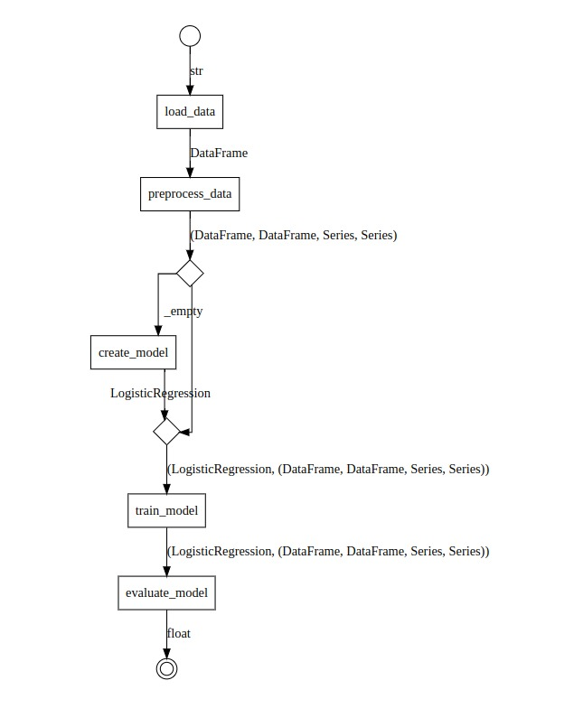

(gloe-scikit-learn)=
# Gloe & Scikit-learn

Let's create an example that demonstrates how to use Gloe with [Scikit-Learn](https://scikit-learn.org/) for a machine learning workflow. We will include steps for data loading, preprocessing, model training, and evaluation. A similar example using PyTorch is available {ref}`here <gloe-pytorch>`.

## Setup

Ensure you have the necessary packages installed:

```shell
pip install gloe scikit-learn pandas
```

The below imports are necessary for the rest of the code:

```python
import pandas as pd
from sklearn.model_selection import train_test_split
from sklearn.preprocessing import StandardScaler
from sklearn.linear_model import LogisticRegression
from sklearn.metrics import accuracy_score
from gloe import transformer, partial_transformer
from gloe.utils import attach
```

## Define the Transformers

Let us create transformers for loading data, preprocessing, model creation, training, and evaluation.

### Data Load and Preprocessing

Loading data from a CSV file into a Pandas DataFrame:

```python
@transformer
def load_data(file_path: str) -> pd.DataFrame:
    return pd.read_csv(file_path)
```

The `preprocess_data` transformer preprocesses the DataFrame, splits it into training and test sets, and standardizes the features.

```python
@transformer
def preprocess_data(df: pd.DataFrame) -> tuple[pd.DataFrame, pd.DataFrame, pd.Series, pd.Series]:
    # Assume the last column is the target
    X = df.iloc[:, :-1]
    y = df.iloc[:, -1]
    
    # Split data into training and test sets
    X_train, X_test, y_train, y_test = train_test_split(X, y, test_size=0.2, random_state=42)
    
    # Standardize features
    scaler = StandardScaler()
    X_train = scaler.fit_transform(X_train)
    X_test = scaler.transform(X_test)
    
    return X_train, X_test, y_train, y_test
```


Once the type `tuple[pd.DataFrame, pd.DataFrame, pd.Series, pd.Series]` is used in many places, we can create a type alias for it:

```python
from typing import TypeAlias

Data: TypeAlias = tuple[pd.DataFrame, pd.DataFrame, pd.Series, pd.Series]
```

Thus, the definition of the `preprocess_data` transformer can be simplified:

```python
@transformer
def preprocess_data(df: pd.DataFrame) -> Data:
    ...
```


### Model Training and Evaluation

Defining a logistic regression model using Scikit-Learn API:

```python
@transformer
def create_model(_) -> LogisticRegression:
    model = LogisticRegression(random_state=42)
    return model
```

```{note}
Transformers need to have at least one argument. The `_` argument is a placeholder that is not used in the transformer.
```

Training the logistic regression model using the provided data, with the number of iterations specified as a partial argument:
```python
@partial_transformer
def train_model(entry: tuple[LogisticRegression, Data], max_iter: int = 100) -> tuple[LogisticRegression, Data]:
    model, data = entry
    X_train, _, y_train, _ = data
    model.max_iter = max_iter
    model.fit(X_train, y_train)
    return model, data
```

Finally, evaluates the trained model on the test data and returns the accuracy score.
```python
@transformer
def evaluate_model(entry: tuple[LogisticRegression, Data]) -> float:
    model, data = entry
    X_train, X_test, y_train, y_test = data
    y_pred = model.predict(X_test)
    accuracy = accuracy_score(y_test, y_pred)
    return accuracy
```

## Create the Pipeline

The transformers are composed into a pipeline using the `>>` operator.
`load_data`, `preprocess_data`, `create_model`, `train_model`, and `evaluate_model` are chained together. The `train_model` transformer is provided with the `max_iter` parameter using the partial transformer method.

```python
pipeline = (
    load_data >> preprocess_data >>
    attach(create_model) >> train_model(max_iter=200) >> evaluate_model
)
```


The only point that needs attention is the {func}`attach <gloe.utils.attach>` function that is used to attach the input of the `create_model` transformer to its output. 

Let's analyze the types carefully:

- `create_model` has a type `Transformer[Any, LogisticRegression]`.
- `train_model` has a type `Transformer[tuple[LogisticRegression, Data], tuple[LogisticRegression, Data]`.

So, we cannot connect them directly. The `attach` function receives the `create_model` transformer and returns a new transformer with the input of `create_model` attached to its output. The transformer returned by `attach` has the type `Transformer[Data, tuple[LogisticRegression, Data]`: exactly what the `train_model` needs.


### Run the Pipeline

The pipeline is executed by calling it directly with the input file_path. The final output is the accuracy of the model evaluation.

```python
def main():
    file_path = 'data.csv'
    accuracy = pipeline(file_path)
    print(f"Model evaluation accuracy: {accuracy}")

main()
```

### Plot the Pipeline

Finally, we can visualize the pipeline using the {meth}`.to_image() <gloe.BaseTransformer.to_image>` method:

```python
pipeline.to_image('scikit-learn-pipeline.png')
```



