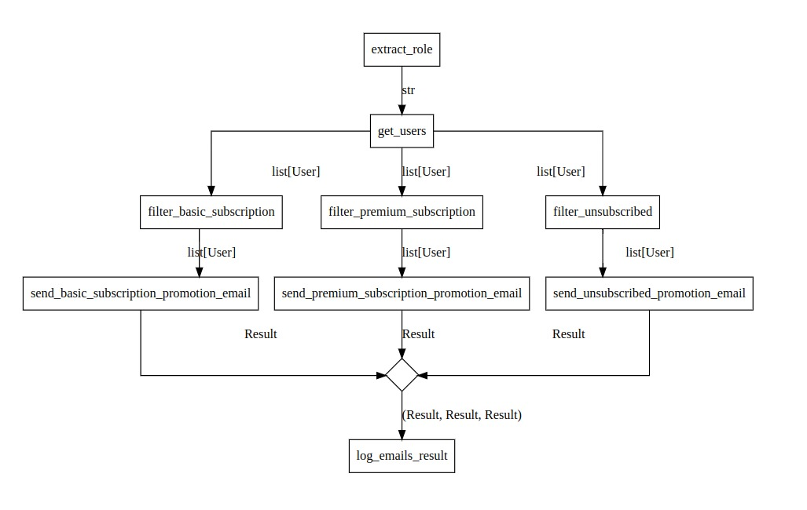

# Plotting the Graph ⚠

```{admonition} Under development
:class: danger

You should not use the plotting feature in a production enviroment. We are still developing and testing it.
```
```{admonition} Dependencies
:class: warning

This feature requires the library [pygraphviz](https://pygraphviz.github.io).
```


Every transformer has two methods to plot the graph of the flow:
- `.to_dot()`: which is used to export the transformer as graph using the [dot format](https://graphviz.org/doc/info/lang.html). 
- `.to_image()`: used to export the transformer as an image.

## Example

Assume the following graph:

```python
@transformer
def extract_request_id(request: Request) -> int: ...

@transformer
def get_user_by_id(user_id: int) -> User: ...

@transformer
def get_last_seen_items(user: User) -> list[Product]: ...

@transformer
def get_last_ordered_items(user: User) -> list[Product]: ...

@transformer
def get_user_network_data(users: User) -> UserNetwork: ...

@transformer
def get_recommended_items(
    items: tuple[list[Product], list[Product], UserNetwork]
) -> list[Product]: ...

@transformer
def group_by_department(items: list[Product]) -> DepartmentWithItems: ...


get_user_recommendations = (
    extract_request_id
    >> get_user_by_id
    >> (
        get_last_ordered_items,
        get_last_seen_items,
        get_user_network_data,
    )
    >> get_recommended_items
    >> group_by_department
)
```

We can call the method `.to_image()` of the `get_user_recommendations` transformer instance:
```python
get_user_recommendations.to_image('get_user_recommendations.png', with_edge_labels=True)
```

The resulted plot is:



We can also call the `.to_dot()` method:
```python
get_user_recommendations.to_dot('get_user_recommendations.dot', with_edge_labels=True)
```

Then, we can use any dot visualizer tool to plot the graph. For example, we can use [edotor.net](https://edotor.net/). We need just to copy the content of `get_user_recommendations.dot` file and paste it on edotor.net editor.
> [Click here](https://edotor.net/?engine=dot#strict%20digraph%20%22%22%20%7B%0A%09graph%20%5Bcompound%3DTrue%2C%0A%09%09splines%3Dortho%2C%0A%09%09style%3Ddotted%0A%09%5D%3B%0A%09node%20%5Blabel%3D%22%5CN%22%5D%3B%0A%09begin%09%5B_label%3Dbegin%2C%0A%09%09height%3D0.3%2C%0A%09%09label%3D%22%22%2C%0A%09%09shape%3Dcircle%2C%0A%09%09width%3D0.3%5D%3B%0A%09%225dda07de-45d3-4e27-b506-9a0b7b6bbd61%22%09%5Blabel%3Dextract_request_id%2C%0A%09%09shape%3Dbox%2C%0A%09%09transformer%3D%22Request%20-%3E%20(extract_request_id)%20-%3E%20int%22%5D%3B%0A%09begin%20-%3E%20%225dda07de-45d3-4e27-b506-9a0b7b6bbd61%22%09%5Blabel%3DRequest%5D%3B%0A%09%223927a4b6-d467-4505-b4da-d2b60b8ebf5b%22%09%5Blabel%3Dget_user_by_id%2C%0A%09%09shape%3Dbox%2C%0A%09%09transformer%3D%22int%20-%3E%20(get_user_by_id)%20-%3E%20User%22%5D%3B%0A%09%225dda07de-45d3-4e27-b506-9a0b7b6bbd61%22%20-%3E%20%223927a4b6-d467-4505-b4da-d2b60b8ebf5b%22%09%5Blabel%3Dint%5D%3B%0A%09%220d214870-a853-4cf1-be6c-0b947356eae7%22%09%5B_label%3Dgateway_begin%2C%0A%09%09height%3D0.4%2C%0A%09%09label%3D%22%22%2C%0A%09%09shape%3Ddiamond%2C%0A%09%09width%3D0.4%5D%3B%0A%09%223927a4b6-d467-4505-b4da-d2b60b8ebf5b%22%20-%3E%20%220d214870-a853-4cf1-be6c-0b947356eae7%22%09%5Blabel%3DUser%5D%3B%0A%09%2262043710-fbb8-4518-bd21-08f9996a452c%22%09%5Blabel%3Dget_last_ordered_items%2C%0A%09%09shape%3Dbox%2C%0A%09%09transformer%3D%22User%20-%3E%20(get_last_ordered_items)%20-%3E%20list%5BProduct%5D%22%5D%3B%0A%09%220d214870-a853-4cf1-be6c-0b947356eae7%22%20-%3E%20%2262043710-fbb8-4518-bd21-08f9996a452c%22%09%5Blabel%3DUser%5D%3B%0A%09%22f19996c2-9f5b-4847-9f18-ffffa9a5a9af%22%09%5Blabel%3Dget_last_seen_items%2C%0A%09%09shape%3Dbox%2C%0A%09%09transformer%3D%22User%20-%3E%20(get_last_seen_items)%20-%3E%20list%5BProduct%5D%22%5D%3B%0A%09%220d214870-a853-4cf1-be6c-0b947356eae7%22%20-%3E%20%22f19996c2-9f5b-4847-9f18-ffffa9a5a9af%22%09%5Blabel%3DUser%5D%3B%0A%09%22cde4f0d7-d834-44c0-8278-585fb3890440%22%09%5Blabel%3Dget_user_network_data%2C%0A%09%09shape%3Dbox%2C%0A%09%09transformer%3D%22User%20-%3E%20(get_user_network_data)%20-%3E%20UserNetwork%22%5D%3B%0A%09%220d214870-a853-4cf1-be6c-0b947356eae7%22%20-%3E%20%22cde4f0d7-d834-44c0-8278-585fb3890440%22%09%5Blabel%3DUser%5D%3B%0A%09%225ec2fab0-2a0d-44e0-a337-0560941a67dd%22%09%5B_label%3Dgateway_end%2C%0A%09%09height%3D0.4%2C%0A%09%09label%3D%22%22%2C%0A%09%09shape%3Ddiamond%2C%0A%09%09width%3D0.4%5D%3B%0A%09%2262043710-fbb8-4518-bd21-08f9996a452c%22%20-%3E%20%225ec2fab0-2a0d-44e0-a337-0560941a67dd%22%09%5Blabel%3D%22list%5BProduct%5D%22%5D%3B%0A%09%22f19996c2-9f5b-4847-9f18-ffffa9a5a9af%22%20-%3E%20%225ec2fab0-2a0d-44e0-a337-0560941a67dd%22%09%5Blabel%3D%22list%5BProduct%5D%22%5D%3B%0A%09%22cde4f0d7-d834-44c0-8278-585fb3890440%22%20-%3E%20%225ec2fab0-2a0d-44e0-a337-0560941a67dd%22%09%5Blabel%3DUserNetwork%5D%3B%0A%09%2255ef052e-6b0e-4547-bdcc-a966e4ef86ba%22%09%5Blabel%3Dget_recommended_items%2C%0A%09%09shape%3Dbox%2C%0A%09%09transformer%3D%22(list%5BProduct%5D%2C%20list%5BProduct%5D%2C%20UserNetwork)%20-%3E%20(get_recommended_items)%20-%3E%20list%5BProduct%5D%22%5D%3B%0A%09%225ec2fab0-2a0d-44e0-a337-0560941a67dd%22%20-%3E%20%2255ef052e-6b0e-4547-bdcc-a966e4ef86ba%22%09%5Blabel%3D%22(list%5BProduct%5D%2C%20list%5BProduct%5D%2C%20UserNetwork)%22%5D%3B%0A%09%22a0cc0029-40e6-4298-b7a6-0e98eaf1275d%22%09%5Blabel%3Dgroup_by_department%2C%0A%09%09shape%3Dbox%2C%0A%09%09transformer%3D%22list%5BProduct%5D%20-%3E%20(group_by_department)%20-%3E%20DepartmentWithItems%22%5D%3B%0A%09%2255ef052e-6b0e-4547-bdcc-a966e4ef86ba%22%20-%3E%20%22a0cc0029-40e6-4298-b7a6-0e98eaf1275d%22%09%5Blabel%3D%22list%5BProduct%5D%22%5D%3B%0A%09end%09%5B_label%3Dend%2C%0A%09%09height%3D0.2%2C%0A%09%09label%3D%22%22%2C%0A%09%09shape%3Ddoublecircle%2C%0A%09%09width%3D0.2%5D%3B%0A%09%22a0cc0029-40e6-4298-b7a6-0e98eaf1275d%22%20-%3E%20end%09%5Blabel%3DDepartmentWithItems%5D%3B%0A%7D%0A) to see this graph on edotor.net.


```{important}
We are already working on a dedicated solution to visualize and interact with Gloe graphs in real time during development.
```
